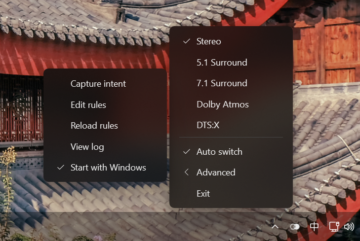

# Final Spatial Audio

[简体中文](README.md) | English

A Windows 11 x64 audio mode manager that runs in the notification area, implemented in pure C11 / Win32.

Switch manually between Stereo, 5.1, 7.1, Dolby Atmos for Home Theater and DTS:X for Home Theater, or select modes automatically using prioritized foreground and running-process rules.

## Screenshot



The screenshot shows the English tray mode menu with the Advanced submenu open.

## Download and run

Download the Windows x64 portable ZIP from [Releases](https://github.com/BestGreed/Final_Spatial_Audio/releases), extract the entire archive and run `bin/FinalSpatialAudio.exe`. Keep the folder structure intact and use a location writable by your user account. The application starts in manual lock and does not change the current audio mode until you select a mode or enable automatic switching.

Standard PCM profiles initially use 24 bit / 48 kHz. Profiles are generated separately for each output device. Spatial audio requires support from Windows, the connected device and the relevant encoder components. Packages contain no personal device snapshots, logs or enabled personal rules.

## Features

- Foreground / Running rules resolved globally by priority, allowing a higher-priority background application to retain its mode.
- Automatic switching toggle, manual lock, external-change detection, debounce, duplicate-switch suppression and attempted rollback on failure.
- Capture intent: save the actual Windows audio settings to the corresponding mode profile.
- Device capability checks, disabled unavailable modes and per-user startup registration.
- Win32 tray menus with translucency, rounded corners, DPI scaling and system Segoe Fluent Icons.
- Automatic Chinese / English UI selection, with an optional configuration override.

## Language

The default `Language=auto` follows the Windows user interface language: Chinese UI languages (including Simplified and Traditional Chinese) use the existing Simplified Chinese UI; all other languages use English. Keyboard layouts and regional number/date formats do not determine the UI language.

To override, edit `final-spatial-audio.ini`:

```ini
[Manager]
Language=auto
```

Values: `auto`, `zh`, `en` (case-insensitive). Missing or invalid values fall back to automatic detection. Restart FSA after changing this setting; Reload rules reloads rules only. Rule keys, mode identifiers and diagnostic logs remain language-independent.

See the [English user guide](docs/User-Guide.en.txt), [architecture](ARCHITECTURE.en.md) and [test documentation](TESTING.en.md).

## Build

Use Windows x64 and Zig 0.14.1. In PowerShell:

```powershell
./native/build.ps1 -Zig <full-path-to-zig.exe>
```

The build runs basic tests and creates `native/bin/FinalSpatialAudio.exe`. To run from the source tree, copy `native/final-spatial-audio.example.ini` to `native/final-spatial-audio.ini`. The example rule is disabled.

Create a portable package and checksums with a fresh output version:

```powershell
./release.ps1 -Zig <full-path-to-zig.exe> -Version 0.1.1
```

No additional runtime installation is required on Windows 11. The package includes both Chinese and English user guides.

## Compatibility

Windows 11 x64 is the target. Some audio policy and visual material paths use undocumented system ABIs, so compatibility with every Windows update, device and driver combination is not guaranteed. A failed switch attempts restoration; verify operation on your own hardware. Builds are unsigned. The background worker runs in the user session, not as a Windows system service. AudioActive / WASAPI Session rules are not implemented.

## License

Original source and documentation use the [Unlicense](LICENSE). Icon artwork is outside that public-domain dedication; see [icon license scope](native/assets/LICENSE.txt). Compiler runtime and system resource notices are in [THIRD_PARTY_NOTICES.md](THIRD_PARTY_NOTICES.md) and `licenses/`.
